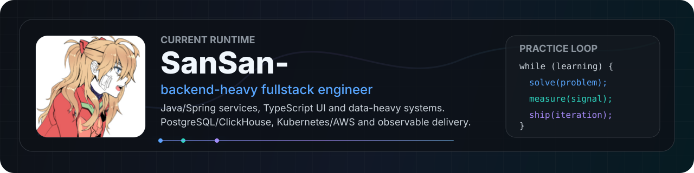

  

Coding seriously since 2007. Building high-load concurrent fintech systems since 2013.

Here is my sandbox for personal projects, experiments and algorithmic practice.

  
  
  

## Stack Map

<table>
  <tr>
    <td><strong>Core</strong></td>
    <td>
      
      
      
    </td>
  </tr>
  <tr>
    <td><strong>Familiar</strong></td>
    <td>
      
      
      
    </td>
  </tr>
  <tr>
    <td><strong>Backend</strong></td>
    <td>
      
      
      
      
      
      
    </td>
  </tr>
  <tr>
    <td><strong>Frontend</strong></td>
    <td>
      
      
      
      
      
      
      
    </td>
  </tr>
  <tr>
    <td><strong>Data</strong></td>
    <td>
      
      
      
      
      
    </td>
  </tr>
  <tr>
    <td><strong>Platform</strong></td>
    <td>
      
      
      
      
      
      
      
      
    </td>
  </tr>
  <tr>
    <td><strong>Tooling</strong></td>
    <td>
      
      
      
      
      
      
      
    </td>
  </tr>
</table>

## LeetCode Track

  
  

  

## Stats

  
  

  
  

  

## Legacy pack

  
Legacy stack I have worked with

   
  <table>
    <tr>
      <td><strong>Languages</strong></td>
      <td>
        
        
      </td>
    </tr>
    <tr>
      <td><strong>DevOps/Data</strong></td>
      <td>
        
        
        
        
      </td>
    </tr>
    <tr>
      <td><strong>Testing</strong></td>
      <td>
        
        
        
      </td>
    </tr>
    <tr>
      <td><strong>Build/Platform</strong></td>
      <td>
        
        
        
      </td>
    </tr>
    <tr>
      <td><strong>Servers/CI/VCS</strong></td>
      <td>
        
        
        
        
        
        
      </td>
    </tr>
  </table>

