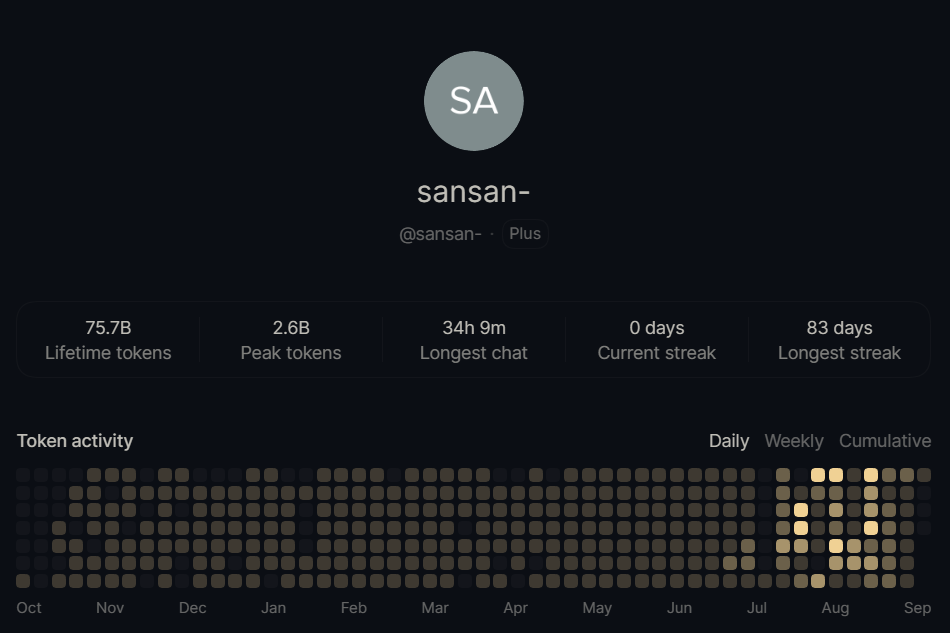
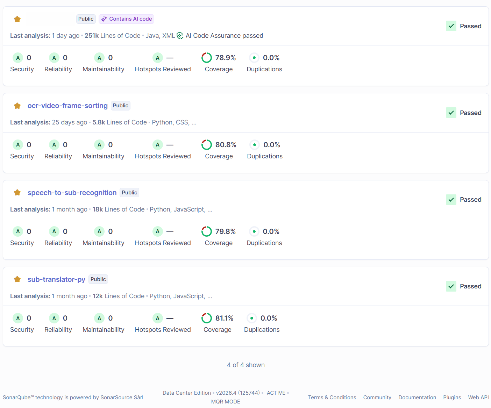
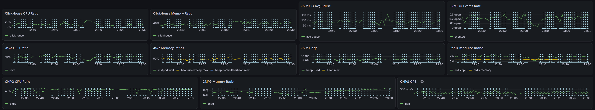
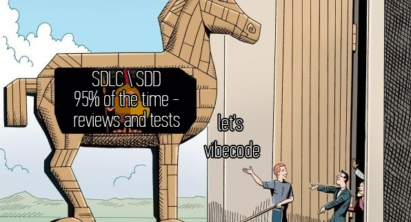

# Thoughts on the AI shake-up and my journey into AI over the past year.

## It all started, as it should, with curiosity.

On September 17, 2025, I finally decided to buy a subscription to the devil machine called ~~ChatGpt~~ Codex, just to
see what kind of beast it was. And off we went. Before that, I had only used local models downloaded from
HuggingFace, mostly for image generation (Stable Diffusion and LUA for it are everything). Now I decided to get into
agentic programming. Codex caught my eye. Claude users gave off the impression of ~~hipsters~~ snobs and show-offs,
while
the platform itself looked overhyped. ~~Proud Kubanoids~~ Simple guys from Texas like me don't mix with that crowd.
Although initially they had a slightly more convenient task-management pipeline and design, now there is no real
difference in that regard. And when it came to actually writing code, Codex had always been stronger.

Over the course of several months, mostly by intuition, I arrived at many things that are considered good practices in
SDD (yes, we'll talk about that today as well) and context management. As usual, I worked my way forward by solving
problems and clearing up things I didn't understand.
First, I needed some way to quickly bring it up to speed every time and explain what I didn't like about its behavior.
So, within the first few days, AGENTS.md instructions and PRD documentation for the project appeared.
My initial complaints were that the agent:

* sometimes broke existing tests - I introduced a mandatory regression build run with tests before responding. later
  I changed the approach entirely, from reactive to proactive, remembering that TDD\BDD existed;
* wrote messy code and put things in the wrong places - I made it a practice to add examples of "how it should be done"
  and "how it should not be done" to the context window, connected a local sonar, wrote a runbook for using it, and tied
  it to one of the main checks before a pull request\release;
* produced lots of duplicates and failed to notice tools that were already in use; wrote lots of duplicated code -
  sonar mostly helped with that, but the project map with its tools helped even more;

Then one of the problems became that the agent would stop halfway through and wait for some further action before
continuing.
By then skills had arrived, plus I came up with the idea of creating an implementation check-list from a template for
every task (with mandatory verification items at the end), and until every box was checked - it wasn't allowed to stop.
(
"Plan" as a mechanism does not always fit, although it can expose potentially unnecessary steps. I needed freedom of
action within the process, because initially the plan was deterministic and you couldn't interfere once it was underway.
Later, closer to 5.5, "Goal" appeared, and that suited me better, but by then I was already using my own check-lists,
mixed together with skills, to the fullest.
The agent could now work for days.)
Once, during the second week of using it, I saw how a task could go beyond the context window and the context itself
would get compressed. And that raised the problem of context overload over time and lost in the middle (native
subagents only appeared in Codex in 5.6).
Then I thought it would be a good idea to write down detailed analysis results for every problem somewhere, so I
wouldn't have to remember every time what exactly had happened there. And it would also be nice to tie each report to
an item in the current task check-list. That's how my hidden project documentation folder quickly grew.
It already contained folders with PRDs for every module and check-lists. Now it also had a folder with reports
(`reports`).

One day, the issue of an agent executing commands with secrets comes up. S - security.
Oh... Have you ever seen a tech lead commit `.env` with access keys (to a private repository, though) without a second
thought?
I have. Also, keep in mind that when using any model through a public
API, [your code, like any of your achievements, does not belong solely to you](https://habr.com/ru/articles/1079940/).
But that's not the point. Your secrets can easily leak into session logs, and you can only wave them away. Even the
instruction "Decrypt secrets only through `sops` at command time. Do not write decrypted secrets into tracked files or
chat output." can be ignored if it appears in the middle of a context window. This should be carefully monitored and, at
the first compromise, secrets should be reissued. Of course, if you're a rich Pinocchio and have an extra 15+ million
lying around, you can buy a good neural network server and deploy a local LLM with a trillion parameters and all the
necessary hardware and forget about this question.

> Over six months, the project has grown by 250K+ lines – a distributed event processing platform (multi-instance, 
> lock coordination, distributed cache, flushing data to CH, dynamic MV).
> The agent releases a feature in a matter of hours, running it through the release pipeline via JMH benchmarks, 
> integration tests on Testcontainers, and Sonar. It builds a Docker image, pushes it to the registry, 
> updates and deploys the Helm build, and then monitors the status using Grafana based on specified metrics.
> If issues arise, it rolls back and opens a ticket. And all this – with a single skill.
> This system burns an incredible amount of tokens, so you have to additionally learn how to manage the context window.

Then the standard subscription stopped being enough for me, and in February I decided to try Pro.
For the first few weeks I couldn't even spend 50% of the weekly budget.
By the way, the agent burned a ridiculous number of tokens when it was forced to fix Sonar errors. I saw a certain
irony in that.
Even while running around the clock, more than 20% still remained.
Then, when 5.6 Sol with subagents came out, it could burn through the weekly allowance on ultra in a single day (almost
3 billion tokens, mind you).
With the release of Astra, inflation hit us, and now the maximum weekly limit (which can still be blown in a day) is
slightly under a billion.
Now I fondly remember the days when it was physically impossible to spend the weekly token limit.
I tried buying extra tokens separately once, but compared to the \$200 subscription, they cost 24 times more (\$4800 a
month - for that money you could hire a senior developer, or two mids. And the funniest part is that to cover my
current demand, it would be cheaper to buy 7 Pro-x20 accounts). I had no intention of throwing money around like that
any further.

> By the way, my personal two cents on the hype around Astra. To me, it's pure marketing. 
> In practice, on ultra, it's (just as dumb) not much smarter than 5.6 Sol.
> The only improvement I actually noticed is that it now inserts LaTeX formulas into Markdown correctly and, overall, 
> generates more (beautiful) meaningful text.

## And we haven't even touched team development yet.

When you want to scale all of this, the question becomes how to formalize and standardize it.
You want to share what you've built up on the project, but in a way that doesn't smell like garage engineering.
That's when it's time to crawl out of your shell and look around.
You realize that there are already a bunch of products on the market offering essentially the same thing out of the box,
wrapped in a particular software development lifecycle concept, already polished (suitable for corporate development),
evolved from the already familiar Agile and BDD.

In reality, it all comes down to the current development culture within the team, ease of learning, and how quickly a
large project can be adapted to SDD.

> If Code Review is not a normal practice in your team, or the procedure has turned into a pure formality 
> (well, everyone's busy - no time and other very important reasons),
> instead of a team you have a collection of individuals, each digging away at their own thing, 
> tests are ~~for losers~~ something a good developer doesn't write, and you disable linters and sonar - then you should
> first develop a proper engineering culture, and try to become a team, work as a team (getting together on Fridays to 
> hang out doesn't count). This can take a month or a year, and if you have constant staff turnover - the process will 
> never end. Developing discipline and an engineering culture is extremely important for successful SDD adoption.
> Otherwise, everything will degrade into specifications lagging behind the code, generating
> garbage instead of working code, with that garbage growing like a snowball.
> Everyone can keep a 250K+ line project clean from Sonar's point of view (although there is actually nothing
> difficult about it, they just don't want to). 

Essentially, there is no real choice here - `openspec` is easy to learn (you can understand the structure and master
the same EARS template in a few hours), and it supports existing projects (brownfield) out of the box.
You should only go with `Spec Kit` if you **ALREADY** have a team well-versed in TDD\BDD\SDD (or, at the very least,
familiar with something like Cucumber) - customization and plugins make lifecycle extensibility limitless.
As for `BMAD Method`, I won't even get into it - that is strictly for teams that have already been living in the SDD
paradigm for years.

## But everything changes when a large corporation starts doing this. What could possibly go wrong?

> Let's take a fictional corporation that sells carrots on a global scale. Any resemblance is purely coincidental. 

* First, only the share of actual writing inside a task's lead time decreases (and even that not always); approvals and
  requests were bottlenecks before, and they will remain bottlenecks.
  The same goes for developing a multi-module project where each module is handled by a separate team - handoff hell
  isn't going anywhere. Even SDD, when applied correctly, can remove only part of the burden (when applied incorrectly,
  it will only make things worse, but more on that later).
* Second, there are internal policies, dependencies, and tools developed inside the company that the AI model knows
  nothing about. We don't reduce the developer's workload; we increase it by adding yet another tool that doesn't work
  properly.
  In principle, this can be solved through Knowledge-oriented RAG (although that still has to be implemented), so it
  isn't that big of a problem.
* And third, wise management and its management style.

As usual, the decision comes down from above through a waterfall (which, for some reason, is still proudly called
"Carrot-gile version 10.0") - all teams must complete training and start living by the new lifecycle by the end of the
year.
Rank-and-file employees are used to it; they've already been living in this Squid Game for the third year. The task of
turning the development lifecycle 180 degrees is perceived as just another challenge. What they forget is that they are
in the position of the [chickens from the joke about Gorbachev and Ryzhkov](https://oper.ru/news/read.php?t=1051610290).

Of course, you could organize an independent implementation committee, with powers similar to security teams, that
would conduct honest readiness audits of every team: something like, you are ready, while all of you need to be rotated,
because breaking habits is hardest in an established group; or, under supervision, force people to learn how to write
bdd tests and first get them used to conducting code reviews (which would have a weaker effect); as well as conduct
follow-up execution audits (after a month, a quarter, a year) for control.
You could, but why? You'd have to get people from somewhere, and we just reported another round of layoffs (cost cuts)
to investors.
It's easier, of course, to put implementation into the goals of middle managers, and have line managers oversee it.
That's like putting wolves in charge of guarding sheep. We'll form a committee, of course, but instead of being
proactive, it will be reactive - we'll hold meetups, training sessions, and collect feedback for cosmetic adjustments.
Larionov and Kutko, who have a financial interest in the outcome, will report successful implementation long before the
end of the year.

Given what the average team in the ward looks like, the outcome is fairly predictable - covert sabotage (maintaining
specifications for show) and, in practice, a rollback to the ordinary development cycle, only now with vibe coding
added on top. Right next door to widespread overload and burnout.

## So what do we end up with?

Specification-driven development does not tolerate a careless attitude, and using it together with AI in the long run,
without changing the underlying approach, only amplifies the negative effect. Development culture has to be cultivated -
the SDLC did not evolve from Waterfall to SDD with agents for no reason. Development with agents is not about freedom at
all, but about boundaries and constraints (and the more of them, the better). And yes, you also have to learn how to
describe things that have always seemed obvious to you personally.

(© generated by the neural network of the brain)

