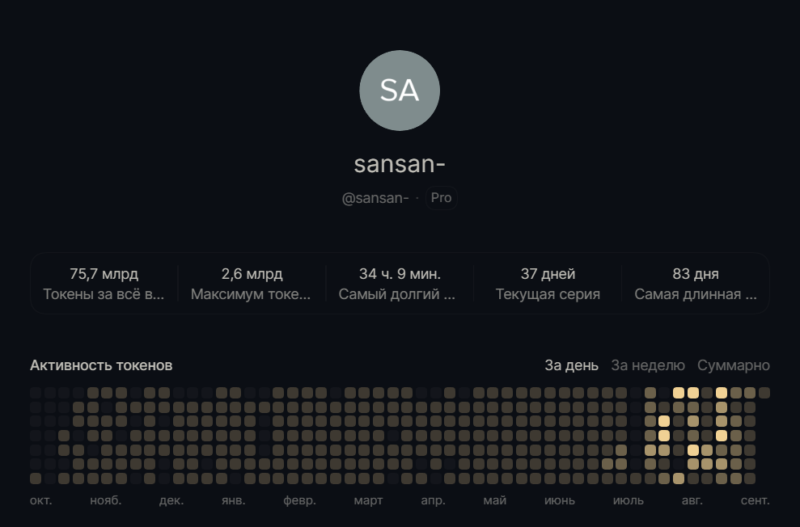

# Мысли по поводу ИИ-тряски и мой путь в ИИ за год.

## Началось всё как полагается с любопытства.

17 сентября 2025 года, я всё-таки решился на покупку абонемента на шайтан-машину по имени ~~ChatGpt~~ Codex, чтобы
посмотреть что это за зверь такой. И понеслась. До этого я пользовался только локальными моделями, скачанным с
HuggingFace, в основном для генерации картинок (Stable Diffusion и LUA под него - наше всё). Теперь решил взяться за
агентное программирование. Глаз пал на Codex. Claude-юзеры производили впечатление ~~хипстеров~~ снобов и зазнаек, а
сама платформа выглядит перехайпленной. ~~Гордым кубаноидам~~ Простым парням из Техаса, вроде меня, с такими не по пути.
Хоть изначально у них был чуть более удобный пайп-лайн ведения задачи и дизайн, сейчас в этом плане они ничем не
отличаются. А именно сторона написания непосредственно кода у Codex всегда была сильнее.

За несколько месяцев я по наитию дошёл до многих вещей, которые считаются хорошими практиками в SDD (да, сегодня мы
про него ещё поговорим) и управлении контекстом. Шёл, как обычно, от решения возникающих проблем и непоняток.
Сначала нужно как-то каждый раз быстро вводить в курс дела и объяснять, что мне в его поведении не нравится.
Так, в первые же дни, появились AGENTS.md инструкции и PRD-документация по проекту.
Первичные претензии были в том, что агент:

- иногда ломал существующие тесты - поставил обязательный регрессионный прогон сборки с тестами перед ответом. потом
  вообще подход поменял, с реактивного на проактивный, вспомнив, что существует TDD\BDD;
- писал грязно и не по месту - ввёл в практику добавлять в контекстное окно пример "как надо" и "как не надо", подключил
  локальный sonar, написал ранбук по его использованию, прикрепил к одной из основных проверок перед
  пулл-рексвестом\релизом;
- много дублей и не видел уже использующиеся инструменты; писал много дублирующегося кода - сонар в основном помог, но
  больше пригодилась карта проекта с инструментами;

Затем, одной из проблем стало то, что агент останавливался на пол-пути и ждал каких-то дальнейших действий для
продолжения.
Тут уже скиллы подоспели, плюс я придумал, чтобы на каждую задачу создавался чек-лист внедрения (implementation
check-list) из шаблона (с обязательными пунктами проверки в конце), и пока все галки не отметит - не останавливается. (
"План" как механика подходит не всегда, хотя может показать потенциально лишние шаги. Мне нужна была свобода действия
внутри процесса, т.к. изначально план был детерминированный и влезать в процессе было нельзя. Потом, уже ближе к 5.5,
появилась "Цель", она уже больше подходила, но тут я уже использовал свои чек-листы, вперемешку со скиллами, по полной.
Агент теперь мог работать сутками.)
Однажды, на вторую неделю использования, я увидел, как задача может выходить за пределы контекстного окна, а контекст
сжиматься. И тут встала проблемой перегрузка контекста со временем и lost in the middle (нативные субагенты в Codex
появились только в 5.6).
Тогда я подумал, что было бы неплохо подробные результаты анализа по каждой проблеме куда-то записывать, чтобы потом не
вспоминать каждый раз, что же там было. А ещё неплохо привязать отчет к пункту в текущем чек-листе задачи. Так у меня
скрытая папка документации проекта быстро разрослась.
Там и так уже были папки с PRD на каждый модуль и чек-листами. Теперь добавилась ещё и папка с отчётами (`reports`).

Однажды всплывает вопрос выполнения агентом команд с секретами. Б - безопасность.
Ооо.. А Вы когда-нибудь видели, как человек на позиции тех-лида без задней мысли коммитит `.env` с не засекреченными
ключами доступа (в приватный репозиторий, но всё же)? Я видел. Плюс учитывайте, в принципе, что используя любую модель
через публичный
API, [ваш код, как и любые ваши достижения, принадлежат не только лишь вам](https://habr.com/ru/articles/1079940/).
Но не суть. Ваши секреты легко могут утечь в логи сессии и тут можно только помахать им рукой. Даже инструкция
"Decrypt secrets only through `sops` at command time. Do not write decrypted secrets into tracked files or chat output."
может быть проигнорирована, если окажется в середине контекстного окна, а секреты попадут в логи.
За этим надо тщательно следить и, при первой же компрометации, перевыпускать секреты. Есс-но, если Вы - богатенький
Буратино и у Вас завалялись лишние 15+ мультов, всегда можно прикупить хороший нейро-сервер и развернуть там локальную
LLM на триллион параметров вместе с обвязкой и забыть про этот вопрос.

> За полгода вырос проект на 250K+ строк - распределённая платформа обработки событий (мультиинстанс, координация
> блокировок, распределенный кэш, сброс данных в CH, динамические MV).
> Агент выводит фичу в релиз за считанные часы, прогоняя по релизному пайп-лайну через JMH бенчи, интеграционные тесты
> на Testcontainers, Sonar, собирает Docker образ, выкладывает его в registry, обновляет и деплоит Helm-сборку, а затем
> мониторит через Grafana состояние по заданным метрикам.
> При возникновении проблем, откатывает и заводит тикет. И это всё - одним skill-ом.
> Такая система сжигает неимоверно много токенов, поэтому дополнительно приходится учиться управлять контекстным окном.

Так мне стало не хватать стандартной подписки и в феврале я решил опробовать `Pro` подписку.
Первые недели я не мог потратить даже 50% от недельного бюджета.
Кстати, агент очень много жрал токены, когда его заставляли исправлять ошибки Sonar. Я видел в этом некую иронию.
Даже в режиме круглосуточной работы, оставалось более 20%.
Потом, когда вышел 5.6 Sol с субагентами, он мог на ультрах за сутки сжечь недельный запас (почти 3 лярда токенов, на
минуточку).
С выходом Astra нас постигла инфляция, и теперь максимальный недельный лимит (всё так же можно всадить за сутки) чуть
меньше лярда.
Теперь я с теплотой вспоминаю времена, когда недельный лимит токенов невозможно было потратить физически.
Пробовал один раз докупать токены отдельно, но в сравнении с подпиской за \$200, они стоят в 24 раза дороже (\$4800 в
месяц - за эти деньги можно сеньор разработчика нанять, либо двух мидлов. А самое смешное, чтобы закрыть текущую
потребность, дешевле купить 7 Pro-х20 аккаунтов). Дальше так раскидываться деньгами я был не намерен.

> Кстати, личные 5 копеек по поводу хайпа вокруг Astra. По мне - чистой воды маркетинг.
> По факту, на ультрах, ~~такой же тупой~~ не сильно умнее 5.6 Sol.
> Единственный прирост, который я действительно заметил - теперь он корректно вставляет LaTeX-формулы в Markdown и,
> в целом, генерирует более ~~красивый~~ осмысленный текст.

## Это мы ещё не касались командной разработки.

Когда ты хочешь это масштабировать, возникает вопрос, как это всё формализовать, стандартизировать.
Хочется поделиться своими наработками по проекту, но так, чтобы не пахло кустарщиной.  
Настаёт время вылезти из скорлупы и оглядеться по сторонам.
Приходит понимание, что на рынке **уже** существует куча продуктов, предлагающих фактически тоже-самое из коробки, в
обёртке определенной концепции жизненного цикла разработки (эволюционировавшей из знакомых Agile и BDD), при этом
вылизанное (пригодное для корпоративной разработки).

На самом деле всё сводится к текущей культуре разработки внутри команды и легкости обучения, а так же быстрой адаптации
большого проекта под SDD.

> Если у вас в команде не принято проводить Code Review, либо процедура превратилась в чистую формальность
> (ну заняты все - некогда; и прочие очень важные причины), вместо команды у вас набор индивидов, где каждый копает
> что-то своё, тесты ~~для лохов~~ хороший разработчик не пишет, а линтеры и сонар вы отключаете - вам стоит для начала
> (подумать зачем вам оно надо) выработать культуру разработки, и попытаться работать как команда (то, что вы по
> пятницам собираетесь вместе посидеть - командной работой не считается).
> На это может уйти и месяц, и год, а если у вас постоянная текучка кадров - процесс не закончится никогда.
> Выработка дисциплины и культуры разработки очень важна для успешного внедрения SDD.
> Иначе всё скатится к отстающим от кода спецификациям, которые вместо работающего кода будут генерировать мусор,
> который будет расти как снежный ком.
> А держать чистый с точки зрения Sonar проект на 250K+ строк может каждый (просто не хочет).

По сути, тут выбор без выбора - `openspec` лёгок в освоении (разобраться в структуре и освоить тот же EARS-шаблон
можно за несколько часов), умеет работать с уже существующими проектами (brownfield) из коробки.
В `Spec Kit` можно идти только если у вас есть **УЖЕ** подкованная в TDD\BDD\SDD команда (в крайнем случае хотя бы
знакомая с тем же кукумбером) - кастомизация и плагины делают расширяемость жизненного цикла безграничным.
Про `BMAD Method` вообще молчу - это исключительно для команд, живущих в SDD парадигме не первый год.

## Но всё меняется, когда этим начинает заниматься большая корпорация. Что же может пойти не так?

> Возьмём вымышленную корпорацию, которая торгует морковками в мировом масштабе.
> Любое совпадение - исключительно совпадение.

- Во-первых, уменьшается только доля писанины (и то не всегда) внутри lead time задачи; согласования и заявки как были,
  так и останутся узким местом.
  Туда же - разработка многомодульного проекта, каждым из которых занимается отдельная команда - handoff hell никуда не
  денется. Даже SDD, при его правильном применении, может убрать лишь часть нагрузки (при неправильном сделает только
  хуже, но про это - дальше).
- Во-вторых, внутренние положения, зависимости и инструменты, разработанные внутри компании, про которые ИИ модель не в
  курсе. Мы не снимаем нагрузку с разработчика, а увеличиваем ещё одним инструментом, который должным образом не
  работает.
  В принципе, решается через Knowledge-ориентированный RAG (а его ещё внедрить нужно), так что не является слишком
  большой проблемой.
- Ну, и в-третьих, мудрое начальство и его способ управления.

Как обычно, ~~Царь бурлит от затей, а Федька потей~~ решение спускается сверху по водопаду (который почему-то до сих пор
гордо зовётся "Морковк-Аджайл версия 10.0") - чтобы до конца года все команды прошли обучение и жили по новому
жизненному циклу.
Линейным сотрудникам не привыкать, они и так живут в этой Игре Кальмара уже третий год. Задачу поменять жизненный цикл
разработки на 180 градусов воспринимают просто как очередное испытание. Правда забывают, что находятся на положении кур
[в анекдоте про Горбачёва и Рыжкова](https://oper.ru/news/read.php?t=1051610290).

Можно конечно было организовать независимый комитет по внедрению, с функциями как у безопасников, который бы проводил
честные аудиты готовности каждой команды и выносил решения: типа, вы - готовы, а вас всех - ротировать, т.к. в
устоявшемся коллективе
сложнее всего ломать привычки, либо под присмотром заставлять учиться bdd-тесты писать и код ревью для начала приучить
проводить (что слабее будет по эффекту); а так же повторные аудиты исполнения (через месяц, квартал, год) для контроля.
Можно, а зачем? Это ж надо людей откуда-то брать, а мы только что отчитались инвесторам об очередной пачке сокращений
(издержек). Проще, конечно, поставить внедрение в цели менеджерам среднего звена, а линейных руководителей -
проконтролировать. Это всё равно, что дать волкам сторожить овец. Комитет мы конечно соберём, но вместо проактивного, он
будет реактивным - будем проводить митапы, обучение и собирать обратную связь для косметических правок.
Материально заинтересованные Ларионов и Кутько отчитаются об успешном внедрении задолго до конца года.

Учитывая, какие в среднем по палате команды, итог несколько предсказуем - скрытый саботаж (ведение
спецификаций для галочки) и откат на практике к обычному циклу разработки, только теперь ещё и с вайбкодингом. По
соседству с повальным перегрузом и выгоранием.

## Что имеем в оконцовке?

Разработка по спецификациям не терпит небрежного отношения, а использование вкупе с ИИ на долгосроке, без изменения
подхода, только усиливает негативный эффект. Культуру разработки надо вырабатывать - SDLC прошёл эволюционный путь от
Водопада до SDD с агентами не просто так. Разработка с агентами - это вообще не про свободу, а про рамки и ограничения
(и чем больше, тем лучше). Ну и да, так же необходимо учиться описывать то, что всегда лично тебе казалось очевидным.

(© сгенерировано нейросетью головного мозга)